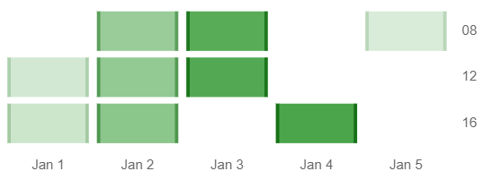

# chartjs-chart-matrix

[Chart.js](https://www.chartjs.org/) **v3.0.0** module for creating matrix charts

[](https://www.npmjs.com/package/chartjs-chart-matrix)
[](https://github.com/kurkle/chartjs-chart-matrix/releases/latest)


[](https://sonarcloud.io/summary/new_code?id=kurkle_chartjs-chart-matrix)
[](https://chartjs-chart-matrix.pages.dev)

## Documentation

To create a matrix chart, include `chartjs-chart-matrix.js` after `chart.js` and then create the chart by setting the `type` attribute to `'matrix'`

```js
const chart = new Chart(ctx, {
  type: 'matrix',
  data: dataObject
});
```

## Configuration

Matrix chart allows configuration of `width` and `height` of the data points in addition to standard Chart.js configuration.

```js
const chart = new Chart(ctx, {
  type: 'matrix',
  data: {
    datasets: [{
      label: 'My Matrix',
      data: [
        {x: 1, y: 1, v: 11},
        {x: 2, y: 2, v: 22},
        {x: 3, y: 3, v: 33}
      ],
      backgroundColor: function(ctx) {
        var value = ctx.dataset.data[ctx.dataIndex].v;
        var alpha = (value - 5) / 40;
        return Color('green').alpha(alpha).rgbString();
      },
      width: function(ctx) {
        var a = ctx.chart.chartArea;
        return (a.right - a.left) / 3.5;
      },
      height: function(ctx) {
        var a = ctx.chart.chartArea;
        return (a.bottom - a.top) / 3.5;
      }
    }]
  },
});
```

## Example



## Development

You first need to install node dependencies  (requires [Node.js](https://nodejs.org/)):

```bash
> npm install
```

The following commands will then be available from the repository root:

```bash
> npm run build        // build dist files
> npm test             // run all tests
> npm run lint         // perform code linting
> npm package          // create an archive with dist files and samples
```

## License

chartjs-chart-matrix is available under the [MIT license](https://opensource.org/licenses/MIT).
